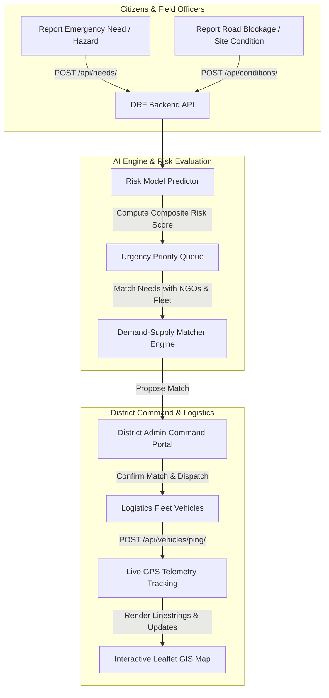

# SETU — System Architecture, Hosting & Operational Information

> **SETU** (*Bridge for Emergency Relief & Logistics*) is an AI-powered geospatial logistics and disaster relief accessibility platform designed for real-time route monitoring, disruption prediction, demand-supply matching, GPS fleet tracking, and offline field reporting across Northeast India.

---

## 📋 Executive System Summary

| Parameter | Specification |
|---|---|
| **System Name** | SETU (Disaster Relief & Geospatial Logistics Platform) |
| **Target Region** | Northeast India (Assam, Meghalaya, Tripura, Mizoram, Manipur, Nagaland, Arunachal Pradesh, Sikkim) |
| **Architecture** | Decoupled Multi-Service SPA + DRF Serverless REST API |
| **Frontend Framework** | React 18, Vite 5, Vanilla CSS3 (Glassmorphism UI), Leaflet GIS Maps |
| **Backend Framework** | Django 5.0, Django REST Framework (DRF), Python 3.12 |
| **Machine Learning Engine** | Scikit-learn, NumPy, Custom Hydro-Meteorological Hazard Predictor |
| **Database & GIS** | SQLite (Local / Serverless), PostGIS / Spatial Compat Layer (`core.spatial_compat`) |
| **Cloud Hosting & Deployment** | Vercel Serverless (`https://setu-jade-three.vercel.app`) |
| **CI/CD Integration** | GitHub (`https://github.com/abijitdas12/SETU.git`) connected to Vercel Auto-Deploy |

---

## 🛠️ Technology Stack Breakdown

### 1. Frontend SPA (`frontend/`)
- **Core Framework**: React 18 with Vite 5 for fast building and HMR.
- **UI & Aesthetic Design**: Modern glassmorphic design system using Vanilla CSS, HSL curated palettes, responsive flex/grid layouts, micro-animations, and custom popover dropdown controls.
- **Geospatial & Mapping**: Leaflet.js (`react-leaflet`) with interactive GeoJSON hazard layers, risk corridor overlays, coordinate markers, and animated route linestrings.
- **Iconography**: Lucide React SVG icon suite (`lucide-react`).
- **HTTP Client**: Axios with request/response interceptors for automatic JWT token management, transparent error handling, and mock dataset fallbacks for offline operational resilience.

### 2. Backend REST API (`backend/`)
- **Core Framework**: Django 5.0 & Django REST Framework (DRF).
- **Authentication**: JWT Authentication (`rest_framework_simplejwt`) with access/refresh token rotation (`/api/auth/token/refresh/`).
- **Role-Based Access Control (RBAC)**: Strict permission enforcement for 6 system roles:
  1. `admin` (Platform Superadministrator)
  2. `district_admin` (District Disaster Management Authority Administrator)
  3. `field_officer` (Ground Assessment & Inspection Officers)
  4. `transport_operator` (Logistics Drivers & Fleet Contractors)
  5. `ngo` (Relief Organizations & Resource Suppliers)
  6. `citizen` (Public Emergency Assistance Seekers)
- **Spatial Compatibility Layer ([`core/spatial_compat.py`](file:///d:/SETU/SETU/backend/core/spatial_compat.py))**: Transparent compatibility bridge allowing seamless switching between full PostGIS spatial database extensions and standard SQLite environments without breaking GIS queries or point geometries.

### 3. AI Risk Model & Demand Matcher (`matching_engine/`)
- **Risk Scoring Predictor ([`predict.py`](file:///d:/SETU/SETU/matching_engine/risk_model/predict.py))**: Multi-factor machine learning model computing real-time flood/landslide risk scores based on:
  - Precipitation sum (24-hour rainfall in mm)
  - Topographic slope grade (degrees)
  - Elevation profile (meters)
  - Soil saturation percentage
  - Drainage quality & vegetation index
- **Priority Queue Engine**: Automated demand-supply matching algorithm calculating composite fit scores based on urgency, geographic proximity (Haversine formula), supplier verification status, and delivery vehicle availability.

---

## ⚙️ How Everything Works (Core Workflows)



### Key Operational Portals
1. **District Command Portal (`DistrictDashboard.jsx`)**:
   - Horizontal segmented sub-navbar for switching between Overview, NGOs, Transporters, Fleet Vehicles, Field Officers, and Government Stockpiles.
   - Priority-sorted AI Demand Matcher queue with animated status badges (`CRITICAL`, `HIGH`, `MEDIUM`, `LOW`).
   - District stress index monitoring and border corridor geofence analyzer.
2. **Field Officer Portal (`FieldOfficerPortal.jsx`)**:
   - On-ground hazard reporting, road condition updates, attachment uploads (photos/documents), and live GPS location pings.
3. **Transport Operator Portal (`TransportPortal.jsx`)**:
   - Vehicle fleet registration, dispatch allocation tracking, and real-time route simulation along GeoJSON linestring coordinates.
4. **NGO & Stockpile Hub (`NgoPortal.jsx`)**:
   - Emergency stockpile inventory registration (food, water, medicine, shelter), verification badges, and supply allocation tracking.
5. **Citizen Portal (`CitizenPortal.jsx`)**:
   - Simple SOS relief demand reporting and interactive road blockage alerts.

---

## ⚡ Performance & Automated Test Verification

- **Frontend Production Build**: Built via Vite in **~4.8 seconds** (`dist/index.html`, `dist/assets/index-CiCVE1Hu.css`, `dist/assets/index-BVJg1OkZ.js`).
- **Automated DRF Test Suite**: 23/23 tests passing across all Django apps:
  - `accounts`: User registration, JWT login, and identity verification endpoints.
  - `core`: District boundary spatial queries, public read access, and non-admin write protection (`401 Unauthorized` / `403 Forbidden`).
  - `logistics`: Fleet vehicle listings and GPS ping coordinate updates.
  - `matching`: AI allocation scoring and match confirmation processing.
- **AI Risk Model Test Suite**: 14/14 unit tests passing for risk scoring, edge-case rainfall inputs, and anomaly detection.

---

## 🌐 Hosting & Vercel Cloud Architecture

### Serverless Architecture (`vercel.json`)
The application is deployed on Vercel using a serverless multi-service configuration:

```json
{
  "services": {
    "frontend": {
      "root": "frontend",
      "framework": "vite"
    },
    "backend": {
      "root": "backend",
      "entrypoint": "config.wsgi:application"
    }
  },
  "rewrites": [
    {
      "source": "/api(/.*)?",
      "destination": {
        "type": "service",
        "service": "backend"
      }
    },
    {
      "source": "/(.*)",
      "destination": {
        "type": "service",
        "service": "frontend"
      }
    }
  ]
}
```

### URL Routing Logic
1. **API Requests (`/api/*`)**: Transparently routed to the Django WSGI backend service (`config.wsgi:application`), executing as high-performance Python serverless functions.
2. **Application Routes (`/*`)**: Routed to the Vite React Single-Page Application (SPA) static bundle served from Vercel's Edge Network CDN.

### Continuous Deployment (CI/CD)
- **GitHub Repository**: Linked to [`https://github.com/abijitdas12/SETU.git`](https://github.com/abijitdas12/SETU.git).
- **Auto-Deploy Pipeline**: Any commit pushed to the `main` branch automatically triggers Vercel to:
  1. Build frontend static assets via `vite build`.
  2. Install backend Python dependencies via `uv`.
  3. Deploy the unified production environment to [https://setu-jade-three.vercel.app](https://setu-jade-three.vercel.app).

---

## 🔒 Security & Compliance Matrix

- **Mass Assignment Defense (SEC-001)**: Public registration strictly permits `citizen` and `ngo` roles. Administrative, Officer, and Operator role escalations are blocked with `400 Bad Request`.
- **Authorization Safeguards (SEC-004 / BOLA)**: Unauthenticated or unauthorized requests to match confirmation (`/api/matches/<id>/confirm/`) or district modifications are blocked with `401 Unauthorized` / `403 Forbidden`.
- **File Upload Protection (SEC-005)**: Script execution protection blocking non-whitelisted extensions (`.html`, `.py`, `.sh`) and restricting upload sizes (>10MB).
- **HTTP Security Headers**: Enforces `X-Frame-Options: DENY`, `X-Content-Type-Options: nosniff`, and `Referrer-Policy: strict-origin-when-cross-origin`.
